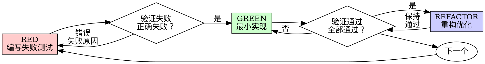

# TDD 规约（TDD-rules.md）

> 全阶段加载，所有开发角色强制遵守。

---

## Iron Law

**禁止在写测试前写实现代码。违反则删除实现，重新开始。**

```
NO PRODUCTION CODE WITHOUT A FAILING TEST FIRST
```

写代码前没有测试？删掉。重新开始。

**无例外：**
- 不要保留作为"参考"
- 不要"边写测试边适配"
- 不要看它
- 删除意味着删除

从测试开始全新实现。句号。

---

## Red-Green-Refactor 循环



### RED - 编写失败测试

编写一个最小测试，展示应该发生什么。

**好的测试：**
```python
def test_retries_failed_operations_3_times():
    """重试失败操作3次"""
    attempts = 0

    def operation():
        nonlocal attempts
        attempts += 1
        if attempts < 3:
            raise Exception('fail')
        return 'success'

    result = retry_operation(operation)

    assert result == 'success'
    assert attempts == 3
```
- 名称清晰，测试真实行为，一次只测一件事

**坏的测试：**
```python
def test_retry_works():
    mock = Mock()
    mock.side_effect = [Exception(), Exception(), 'success']
    retry_operation(mock)
    assert mock.call_count == 3
```
- 名称模糊，测试 mock 而非代码

**要求：**
- 一个行为
- 名称清晰
- 真实代码（除非不可避免，否则不用 mock）

### 验证 RED - 观察失败

**必须执行。禁止跳过。**

```bash
pytest tests/unit/test_xxx.py -v
```

确认：
- 测试失败（不是错误）
- 失败信息是预期的
- 失败原因是功能缺失（不是语法错误）

**测试通过？** 你在测试已存在的行为。修复测试。

**测试报错？** 修复错误，重新运行直到正确失败。

### GREEN - 最小实现

编写刚好能通过测试的最简单代码。

**好的实现：**
```python
async def retry_operation(fn, max_retries=3):
    for i in range(max_retries):
        try:
            return await fn()
        except Exception as e:
            if i == max_retries - 1:
                raise e
    raise Exception('unreachable')
```
刚好足够通过

**坏的实现：**
```python
async def retry_operation(
    fn,
    max_retries=3,
    backoff='linear',
    on_retry=None
):
    # YAGNI - 未请求的功能
    ...
```
过度设计

不要添加功能、重构其他代码，或"改进"超出测试范围的内容。

### 验证 GREEN - 观察通过

**必须执行。**

```bash
pytest tests/unit/ -v
```

确认：
- 测试通过
- 其他测试仍然通过
- 输出干净（无错误、警告）

**测试失败？** 修复代码，不是测试。

**其他测试失败？** 立即修复。

### REFACTOR - 重构优化

只在 GREEN 之后：
- 消除重复
- 改进命名
- 提取公共方法

保持测试通过。不要添加行为。

### 重复

下一个功能的下一个失败测试。

---

## 为什么顺序重要

### "我会在之后写测试来验证它是否工作"

之后写的测试立即通过。立即通过证明不了什么：
- 可能测试了错误的东西
- 可能测试了实现而非行为
- 可能遗漏了你忘记的边界情况
- 你从未看到它捕获 bug

测试先行强制你看到测试失败，证明它确实测试了某些东西。

### "我已经手动测试了所有边界情况"

手动测试是临时的。你认为你测试了所有东西，但：
- 没有记录你测试了什么
- 代码变更时无法重新运行
- 压力下容易遗忘情况
- "我试过时有效" ≠ 全面

自动化测试是系统性的。它们每次以相同方式运行。

### "删除 X 小时的工作是浪费"

沉没成本谬误。时间已经过去了。你现在选择：
- 删除并用 TDD 重写（X 更多小时，高置信度）
- 保留它并在之后添加测试（30 分钟，低置信度，可能有 bug）

保留未经验证的代码是技术债务。没有真正测试的工作代码就是技术债务。

### "TDD 是教条的，务实意味着适应"

TDD 是务实的：
- 在提交前发现 bug（比之后调试更快）
- 防止回归（测试立即捕获破坏）
- 记录行为（测试展示如何使用代码）
- 启用重构（自由变更，测试捕获破坏）

"务实"的捷径 = 生产环境调试 = 更慢。

### "之后测试达到相同目标 - 是精神不是仪式"

不。之后测试回答"这做什么？"测试先行回答"这应该做什么？"

之后测试受你实现的影响。你测试你构建的东西，而不是需要的东西。你验证记住的边界情况，而不是发现的那些。

测试先行强制在实现前发现边界情况。之后测试验证你记住了所有东西（你没有）。

之后 30 分钟的测试 ≠ TDD。你获得了覆盖率，失去了测试有效的证明。

---

## 常见合理化（禁止）

| 借口 | 现实 |
|------|------|
| "太简单不需要测试" | 简单代码也会出错。测试需要 30 秒。 |
| "我会在之后测试" | 立即通过的测试证明不了什么。 |
| "之后测试达到相同目标" | 之后测试 = "这做什么？" 测试先行 = "这应该做什么？" |
| "已经手动测试了" | 临时的 ≠ 系统性的。没有记录，无法重新运行。 |
| "删除 X 小时是浪费" | 沉没成本谬误。保留未验证代码是技术债务。 |
| "保留作为参考，先写测试" | 你会适配它。那就是之后测试。删除意味着删除。 |
| "需要先探索" | 可以。丢弃探索，用 TDD 开始。 |
| "测试难 = 设计不清" | 倾听测试。难测试 = 难使用。 |
| "TDD 会拖慢我" | TDD 比调试更快。务实 = 测试先行。 |
| "手动测试更快" | 手动无法证明边界情况。每次变更都要重新测试。 |
| "现有代码没有测试" | 你在改进它。为现有代码添加测试。 |

---

## Red Flags - 停止并重新开始

- 代码在测试之前
- 实现后测试
- 测试立即通过
- 无法解释为什么测试失败
- "稍后"添加的测试
- 合理化"就这一次"
- "我已经手动测试了它"
- "之后测试达到相同目的"
- "是精神不是仪式"
- "保留作为参考"或"适配现有代码"
- "已经花了 X 小时，删除是浪费"
- "TDD 是教条的，我在务实"
- "这不同因为..."

**所有这些都意味着：删除代码。用 TDD 重新开始。**

---

## 测试反模式

| 反模式 | 问题 |
|--------|------|
| 测试 mock 行为而非真实行为 | 测试没有验证实际功能 |
| 添加仅用于测试的方法到生产类 | 污染生产代码 |
| 不理解依赖就 mock | 隐藏真实问题 |

---

## 验证清单

标记工作完成前：

- [ ] 每个新函数/方法都有测试
- [ ] 观察每个测试在实现前失败
- [ ] 每个测试因预期原因失败（功能缺失，不是语法错误）
- [ ] 编写最小代码通过每个测试
- [ ] 所有测试通过
- [ ] 输出干净（无错误、警告）
- [ ] 测试使用真实代码（除非不可避免，否则不用 mock）
- [ ] 边界情况和错误已覆盖

无法勾选所有方框？你跳过了 TDD。重新开始。

---

## 最终规则

```
生产代码 → 测试存在且先失败
否则 → 不是 TDD
```

无用户明确许可，无例外。
